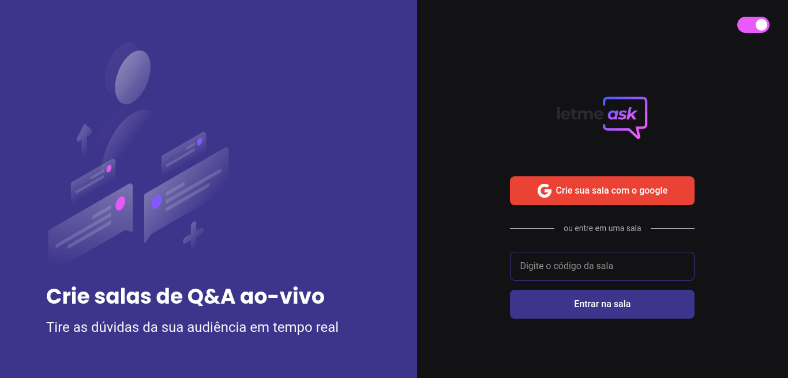

<h1 align="center">
   
  
   
</h1>

Aplicação de salas de Q&A criada durante o NLW together da Rocketseat.

  

    

 

## :hammer: Tecnologias

Este projeto foi desenvolvido com as seguintes tecnologias:

- HTML5
- CSS
- React
- TypeScript
- Firebase

## 🚀 Execute o projeto

1. Clone este repositório `git clone https://github.com/dudunog/letmeask.git`
2. Entre no diretório do projeto `cd letmeask`
3. Instale as dependências com `yarn install` ou `npm install`
4. Crie um arquivo `.env.local` com suas credencias do firebase
5. Inicie o projeto com `yarn run start` ou `npm run start`
